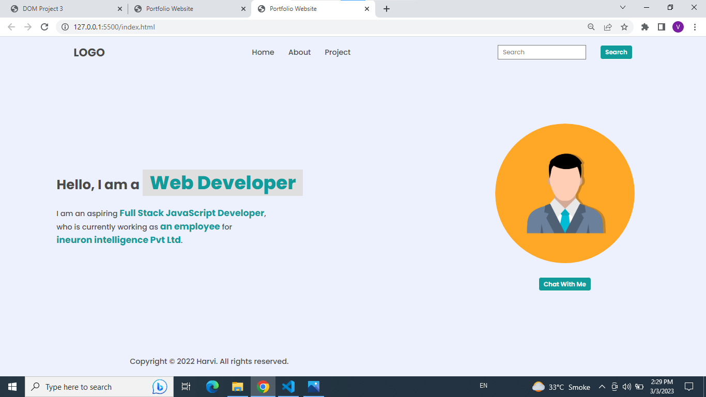
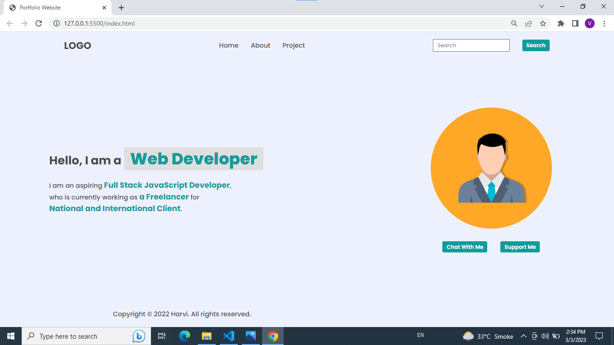
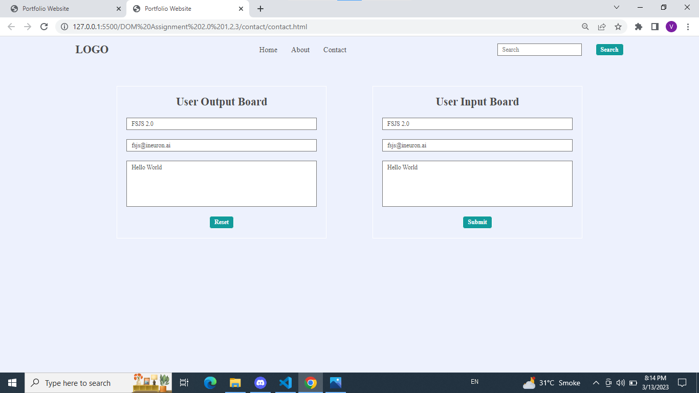

**Assignment1 soltion**

**task 1 solution**
---


---

#solution code

```javascript
let element= document.createElement("li");
element.innerHTML="<a>Hire Me</a>"

 let parent=document.querySelector("header nav ul")
console.log(parent.appendChild(element));
```
---

**task2-solution**


---

**Solution code**
```JavaScript
 let newElement=  document.createElement("li")
     let newText=  document.createTextNode("Project")
         newElement.appendChild(newText)

    let target= document.querySelector("ul")
    let oldElement=target.children[2];
    // console.log(oldElement)
     
    target.replaceChild(newElement,oldElement);

    let a =document.querySelector(".search-field input");
     a.placeholder="Search My project";

```
---
**task3-solution**



**solution code**

```javascript
let element=document.querySelectorAll(".hero-left-section span");
element[2].innerText="an employee"
element[3].innerText="ineuron intelligence Pvt Ltd"

```

---
**task 4 solution**



**solution code**

```javascript
let parent=document.querySelector(".hero-right-section-btns")
let newbtn=document.createElement("button")
newbtn.innerText="Support Me"
parent.appendChild(newbtn)
```
---

**Assignment-2 solution**

**task 1 solution**


**solution code**

```javascript
let heading = document.querySelectorAll(".accordian h3")
    let para  =   document.querySelectorAll(".accordian p")

    heading.forEach((element)=>{
             element.style.backgroundColor="#B9DDFF"
    })

    para.forEach((element)=>{
        element.style.backgroundColor="E9EEFF"
    })
```

---
**Assignment3 Solution**



**solution code**
```javascript
let myForm = document.querySelectorAll("form")
myForm[1].addEventListener("submit",(event)=>{
    event.preventDefault();


// getting the entered data
let name= document.querySelector(".userName");
let email= document.querySelector(".userEmail");
let message=document.querySelector(".userMessage");

// setting the enterd data
let setName = document.querySelector(".enterName");
let setEmail = document.querySelector(".enterMail");
let setMessage = document.querySelector(".enterMessage");

setName.value= name.value
setEmail.value= email.value
setMessage.value= message.value
})
```
